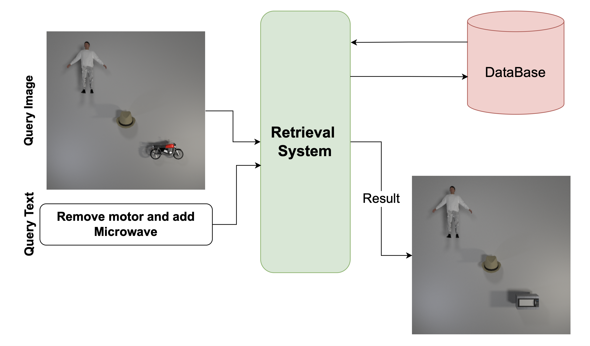

# ⭐️ Compositional Image Retrieval Challenge
*Contributors: [Ali Nafisi](https://safinal.github.io/), [Hossein Shakibania](https://scholar.google.com/citations?user=huveR90AAAAJ&hl=en&authuser=1)*

[](https://huggingface.co/spaces/safinal/compositional-retrieval)

[](https://opensource.org/licenses/MIT)
 
## 🔍 Overview
This repository contains our solution for the Compositional Image Retrieval Challenge, part of the [**Rayan International AI Contest**](https://ai.rayan.global). The challenge aims to develop a system capable of retrieving the most relevant image from a database by understanding a combination of visual and textual inputs.

## 🎯 Challenge Objective

The task requires building a system that can:

- **Process input consisting of:**
  - A reference image containing a visual scene
  - A text description providing additional context or modifications

- **Identify and return** the single most relevant matching image from a provided database.

The figure below serves as an example of this task:
<p class="row" float="left" align="middle">

</p>

## 🚀 Our Approach

Our approach leverages natural language processing and vision-language models to achieve compositional retrieval in an efficient and innovative manner, while adhering to contest constraints.

### 1. **DistilBERT Language Model for Object Identification from Query Text**
We wanted to have a model that can identify the objects in the query text that will be added and removed from the query image, directly influencing the target image. 

To create a dataset for our task, we utilized free versions of LLMs such as *Gemini, GPT, and Claude*. These models generated 635 unique templates resembling the Query Text, available in the `prompt_templates.json` file. Using predefined objects, we expanded these templates into 15 variations each, resulting in a dataset of 9,525 instances.

Then we fine-tuned the [DistilBERT](https://arxiv.org/abs/1910.01108) language model on the curated dataset. The model classifies tokens in the query text into three categories:
- **Positive (pos):** Objects to be added to the query image.
- **Negative (neg):** Objects to be removed from the query image.
- **Other:** Articles, verbs, punctuations, or irrelevant terms.

An example output demonstrates the DistilBERT model’s capability to identify actionable tokens:
>*"Take out the jacket and the sketchpad; add a laptop, a watering can, and a basket."*

`other: take`, `other: out`, `other: the`, `neg: jacket`, `other: and`, `other: the`, `neg: sketchpad`, `other: ;`, `other: add`, `other: a`, `pos: laptop`, `other: ,`, `other: a`, `pos: watering`, `pos: can`, `other: ,`, `other: and`, `other: a`, `pos: basket`, `other: .`

Using this classification, we generate embeddings for each positive and negative object using a template, *"a photo of a \<object>."*. These embeddings are later used to refine the query image embedding.

### 2. **Fine-Tuned ViTamin for Multi-Modal Feature Extraction**
We finetuned a variant of the [ViTamin](https://beckschen.github.io/vitamin) model from [OpenCLIP](https://github.com/mlfoundations/open_clip), a robust vision-language model, as the backbone for extracting features from both textual and visual modalities. The core innovation lies in modifying the query image embedding:
- **Adding** embeddings of positive objects derived from the query text.
- **Subtracting** embeddings of negative objects.

This process dynamically adjusts the query embedding to closely represent the target image's characteristics. By avoiding reliance on object detection, image captioning, or directly-used LLMs, our approach remains computationally efficient while adhering to contest constraints.


## 🏆 Results

Our solution for this Challenge achieved outstanding results. The evaluation metric for this challenge is **Accuracy**, with models tested on a private test dataset. Our model achieved the **highest score**, outperforming competitors with a noticeable margin.

The table below presents a summary of the Top 🔟 teams and their respective accuracy scores:

| **Rank** | **Team**                             | **Accuracy (%)** |
|----------|--------------------------------------|------------------|
|🥇        | **No Trust Issues Here (Our Team)**  | **95.38**        |
|🥈        | Pileh                                | 84.61            |
|🥉        | AI Guardians of Trust                | 88.59            |
| 4        | AIUoK                                | 87.30            |
| 5        | red_serotonin                        | 86.90            |
| 6        | GGWP                                 | 85.70            |
| 7        | Persistence                          | 85.20            |
| 8        | AlphaQ                               | 84.50            |
| 9        | Tempest                              | 83.90            |
| 10       | Scientific                           | 82.70            |


## ⚙️ Model Constraints

- **📏 Maximum Model Size:** 4GB  

- **🚫 Not Allowed in Final Model for Inference:**  
  - ❌ Large Language Models (LLMs)  
  - ❌ Object detection models  
  - ❌ Pre-trained models that directly solve the task without modifications  

- **✅ Allowed:**  
  - ✔️ Pre-trained Vision-Language Models (e.g., CLIP), if fine-tuned for this task  

## 🏃🏻‍♂️‍➡️ Steps to Set Up and Run

Follow these instructions to set up your environment and execute the training pipeline.

### 1. Clone the Repository
```bash
git clone git@github.com:safinal/compositional-retrieval.git
cd compositional-retrieval
```
### 2. Set Up the Environment
We recommend using a virtual environment to manage dependencies.

Using ```venv```:
```bash
python -m venv venv
source venv/bin/activate       # On macOS/Linux
venv\Scripts\activate          # On Windows
```
Using ```conda```:
```bash
conda create --name compositional-retrieval python=3.8 -y
conda activate compositional-retrieval
```
### 3. Install Dependencies
Install all required libraries from the ```requirements.txt``` file:
```bash
pip install -r requirements.txt
```
### 4. Train the Model
DistilBert:
```bash
python run.py --modelType token_cls --config ./config/token_cls_cfg.yaml
```
Retrieval Model:
```bash
python run.py --modelType retrieval --config ./config/retrieval_cfg.yaml
```

## 🫶🏻 Acknowledgment
We thank the authors of [DistilBERT](https://arxiv.org/abs/1910.01108) and [ViTamin](https://beckschen.github.io/vitamin) and the creators of [OpenCLIP](https://github.com/mlfoundations/open_clip) for their invaluable contributions to the development of vision-language models.

## 🤝🏼 Contributions
We welcome contributions from the community to make this repository better!
